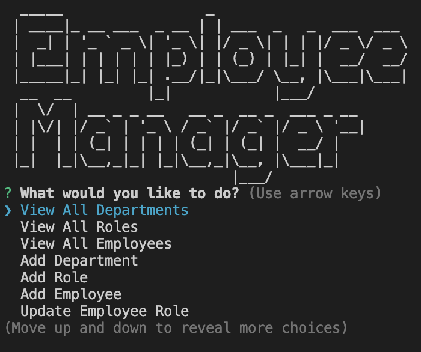

# Employee-Tracker

## Description

- The purpose of this repository is for a business owner to be able to view and manage the departments, roles, and employees in their company so that they can organize and plan their business.
- This is done by having a content management system (CMS) by building a command-line application from scratch to manage a company's employee database, using Node.js, Inquirer, and MySQL.

## Usage

- [Click here](*) for a video demo of this application.

---------------------------

- Screenshots:

---------------------------

## Credit

### Resources :books:
- Bootcamp Materials
- Demonstration by instructor in office hours
- Demonstration by TA in class
- Tutor
- AskBCS Learning Assistants
- [MySQL Tutorial for Beginners](https://www.youtube.com/watch?v=7S_tz1z_5bA)

### Assets :sparkles:
- [MySQL2 Package](https://www.npmjs.com/package/mysql2)
- [Inquirer Package](https://www.npmjs.com/package/inquirer/v/8.2.4)
- [console.table Package](https://www.npmjs.com/package/console.table)
- ASCII Art: [patorjk](https://patorjk.com/software/taag/)

### Applications Used :gear:
- VS Code
- Screencastify

Thank you for visiting! :ribbon:
