# Employee-Tracker

## Description

- The purpose of this repository is for a business owner to be able to view and manage the departments, roles, and employees in their company so that they can organize and plan their business.
- This is done by having a content management system (CMS) by building a command-line application from scratch to manage a company's employee database, using Node.js, Inquirer, and MySQL.

## Usage

- [Click here](https://drive.google.com/file/d/1g6JWm6U7-4sG2DeQWBQBck1h3Vjw_Ed6/view) for a video demo of this application.

---------------------------

- When you start the application, you are presented with a nice ASCII art sign that reads: "Employee Manager" and the prompt questions below it:

---------------------------

- Department table is shown when you select "View All Departments":

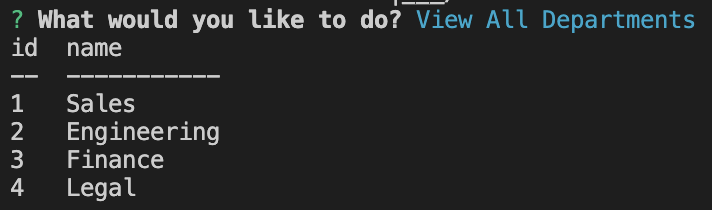

---------------------------

- When you add a department, you will receive a confirmation that your department has been added to the database.

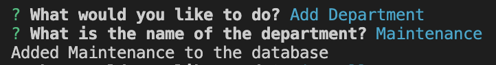

---------------------------

- The newly added department will show when you select "View All Departments":

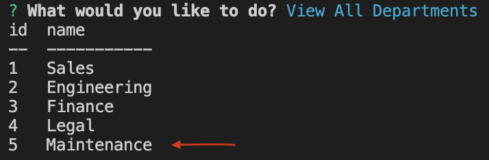

---------------------------

- Role table is shown when you select "View All Roles":

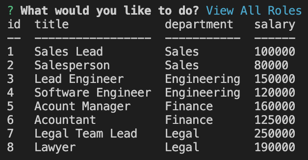

---------------------------

- When you add a role, you will receive a confirmation that your role has been added to the database.

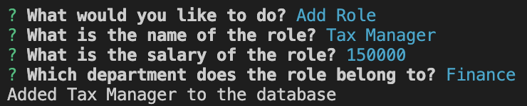

---------------------------

- The newly added role will show when you select "View All Roles":

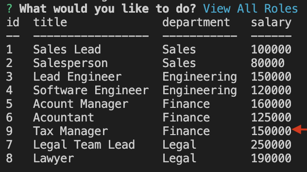

---------------------------

- Employee table is shown when you select "View All Employees":

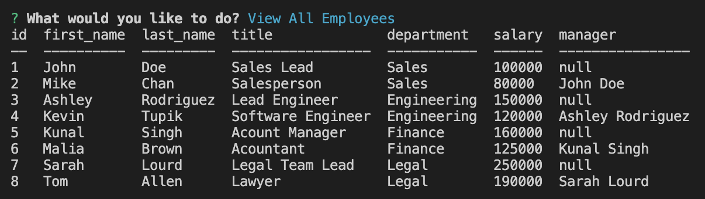

---------------------------

- When you add an employee, you will receive a confirmation that your employee has been added to the database.

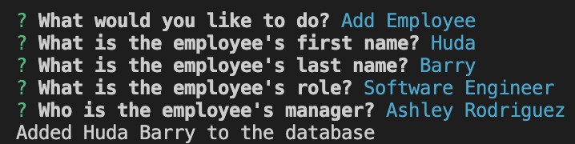

---------------------------

- The newly added employee will show when you select "View All Employees":

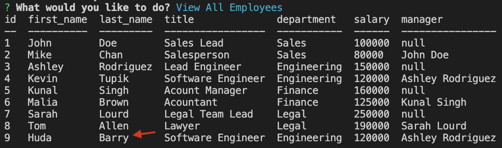

---------------------------

- When you update an employee role, you will receive a confirmation that your employee role has been updated.

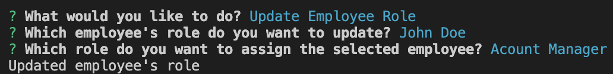

---------------------------

- The newly updated employee will show when you select "View All Employees":

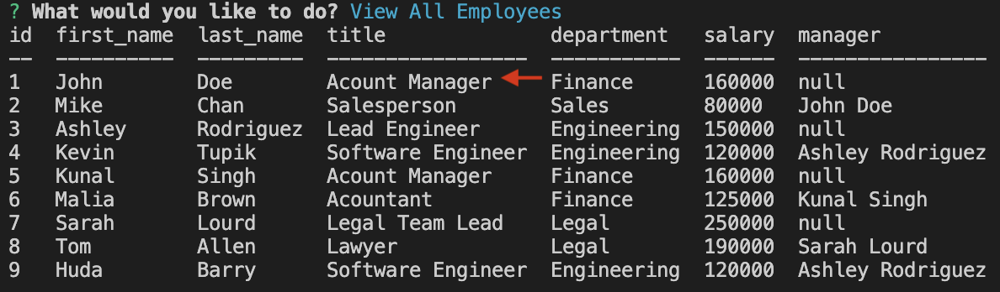

- Compared to previous table:

---------------------------

- When you select "Quit", application will display a thank you message.

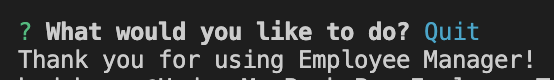

---------------------------

## Credit

### Resources :books:
- Bootcamp Materials
- Demonstration by instructor in office hours
- Demonstration by TA in class
- Tutor
- AskBCS Learning Assistants
- [MySQL Tutorial for Beginners](https://www.youtube.com/watch?v=7S_tz1z_5bA)

### Assets :sparkles:
- [MySQL2 Package](https://www.npmjs.com/package/mysql2)
- [Inquirer Package](https://www.npmjs.com/package/inquirer/v/8.2.4)
- [console.table Package](https://www.npmjs.com/package/console.table)
- ASCII Art: [patorjk](https://patorjk.com/software/taag/)

### Applications Used :gear:
- VS Code
- Screencastify

Thank you for visiting! :ribbon:
